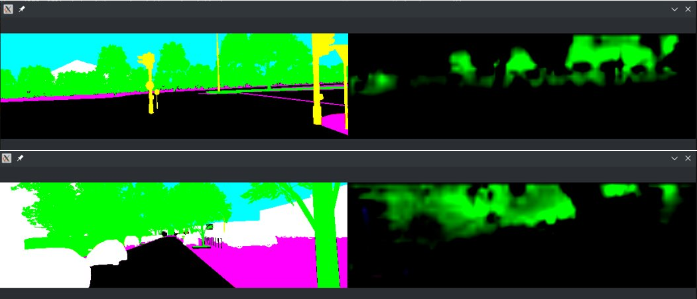

# FusionNet
Semantic segmentation using RGB, LiDAR and Optical flow sensor data
Trained on vkitti dataset.

## Data Preparation
Download vkitti_1.3.1_depthgt.tar, vkitti_1.3.1_flowgt.tar, vkitti_1.3.1_rgb.tar, vkitti_1.3.1_scenegt.tar
from [this link](https://europe.naverlabs.com/research/computer-vision/proxy-virtual-worlds-vkitti-1/). Extract
the tarballs into one folder. Use the path of this folder for `<path_to_dataset>` argument throughout the following
instruction.

## Training
To train, run the following commands:
- `python main.py --dataset_path <path_to_dataset> [--lidar] [--optical_flow]`

The `--lidar` and `--optical_flow` flags are optional. Specifying the flags will train the network with corresponding
LiDAR and oflow data. Without the flags, the network will be trained only on RGB data.

## Testing
To test, run the following commands:
- `python recons.py --dataset_path <path_to_dataset> --checkpoint_path <path_checkpoint_file> [--lidar] [--optical_flow]`

Specify one or both of `--lidar` and `--optical_flow` flags if you had specified it during training. A pretrained checkpoint file
can be downloaded from [here](https://drive.google.com/drive/u/1/folders/1w87XoWLIBTSaBTYX3oaYEoLD2VsUeKmu). Note that if you're using
our checkpoint file, do not specify the `--lidar` and `--optical_flow` flags.

## Results
The below image shows the results of FusionNet. The pictures on the left column are the actual segmentation ground truth and
the pictures on the right column are the segmentation masks obtained from our net.

